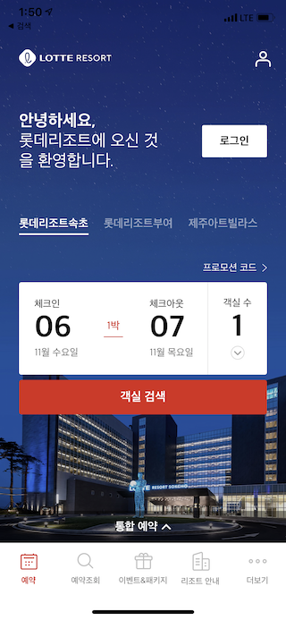
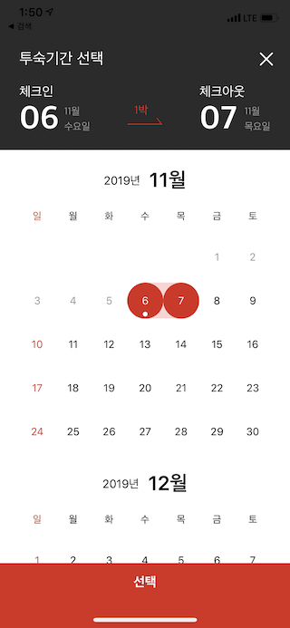
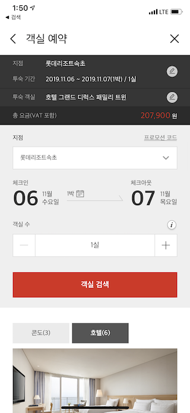

## 목차
- [경력](https://github.com/minss0803/resume#애드캡슐소프트)
     - 애드캡슐소프트
     
- [회사 프로젝트](https://github.com/minss0803/resume#회사-프로젝트)
    - 52TIME
    - 롯데리조트
    - 롯데백화점
    - 컬러테일러
    - Mwave
    - 롯데렌터카
    - 롯데면세점 이음
    - Anymed
    - 뷰티포인트
    - 롯데호텔
 

# 이민혁
### 사용자 경험에 도움되는 인터랙션을 구현하는걸 좋아하는 iOS 개발자입니다. 

 

# 경력
[애드캡슐소프트](http://www.adcapsule.co.kr/)
- 2016.01 ~ 

# 프로젝트
## 회사 프로젝트
### 52TIME
주52시간제에 맞춘 출퇴근 관리
- 기간 : 2019.07-2019.09
- 소속 : 애드캡슐소프트
- 역할 : iOS 앱 개발
- 사용기술 : Swift, RxSwift, Bluetooth, NFC

### 롯데리조트
실시간 리조트 예약
- 기간 : 2019.02-2019.06
- 소속 : 애드캡슐소프트
- 역할 : iOS 앱 개발
- 사용기술 : Swift

### 롯데백화점
쇼핑컨시어지, 사은행사, 쿠폰, Lpoint연동
- 기간 : 2018.02-2018.12
- 소속 : 애드캡슐소프트
- 역할 : iOS 앱 개발
- 사용기술 : Swift, NotificationExtension

### 컬러테일러
사진 속 립스틱 추출 및 제안
- 기간 : 2017.11-2018.02
- 소속 : 애드캡슐소프트
- 역할 : iOS 앱 개발
- 사용기술 : Swift

### Mwave
K-Pop 온라인 투표 플랫폼
- 기간 : 2017.07-2017.10
- 소속 : 애드캡슐소프트
- 역할 : iOS 앱 개발
- 사용기술 : Swift

### 롯데렌터카
렌터카 모바일 예약 앱
- 기간 : 2017.05-2017.07
- 소속 : 애드캡슐소프트
- 역할 : iOS 앱 개발
- 사용기술 : ObjectiveC

### 롯데면세점 이음
가이드 매출 조회 앱
- 기간 : 2017.03-2017.04
- 소속 : 애드캡슐소프트
- 역할 : iOS,Android 앱 개발
- 사용기술 : ObjectiveC, Java

### Anymed
삼성서울병원 교육용 앱
- 기간 : 2017.01-2017.03
- 소속 : 애드캡슐소프트
- 역할 : iOS 앱 개발
- 사용기술 : ObjectiveC

### 롯데호텔
시그니엘 호텔 브랜드 추가 건
- 기간 : 2016.12-2017.01
- 소속 : 애드캡슐소프트
- 역할 : Android 앱 운영
- 사용기술 : ObjectiveC, Beacon, GPS

### 뷰티포인트
아모레퍼시픽 통합 멤버쉽 서비스
- 기간 : 2016.04-2016.11 
- 소속 : 애드캡슐소프트
- 역할 : Android 앱 운영
- 사용기술 : ObjectiveC

### 롯데호텔
롯데호텔예약 서비스
- 기간 : 2016.01-2016.03
- 소속 : 애드캡슐소프트
- 역할 : Android 앱 개발
- 사용기술 : ObjectiveC
